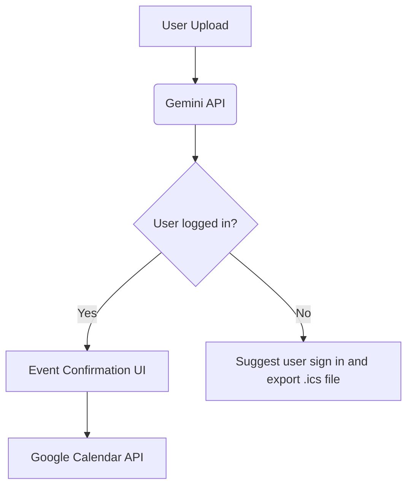

# Smart Calendar Assistant

## 1. **Introduction**
### Purpose
- Automate calendar management through AI-powered document parsing
- Solve manual event entry pain points for students/professionals
- Target audience: University students, busy professionals

### Background
- Traditional calendar apps require manual data entry
- Academic/professional schedules often exist in structured documents
- Leverage modern AI to bridge document → calendar automation
- Future improvements could come in form of a mobile app to streamline other forms of data like going from screenshot to calendar.

---

## 2. **Architecture**
### Architectural Style
- Monolithic architecture (MVP phase)
- Frontend: React + TypeScript
- Backend: Python/FastAPI

### System Components
1. **File Processing Engine**
   - Handle file upload
   - Check Google page for supported file types: https://ai.google.dev/gemini-api/docs/document-processing
   - Google Gemini API for document analysis
   - TXT file support for users to copy-paste chunk of text
   - Future improvements:
     - Support more file types
     - Support screenshot to calendar
2. **Calendar Authentication**
   - Support Google Sign-In for Google Calendar API
   - In the future, support other calendar services like Apple Calendar, Microsoft Calendar, etc.
3. **Calendar Export**
   - Google Calendar API integration
   - If user signed in, add events to user's calendar directly
   - Support .ics file export
4. **User Interface**
   - File upload portal
   - User input box for text
   - Event confirmation/editing interface
   - OAuth2 authentication flow
5. **Database**
   - Not necessary for MVP
   - In the future, support user history, Canvas integration, etc.
### Data Flow

### Technology Stack
| Category        | Technologies                          |
|-----------------|---------------------------------------|
| AI Core         | Google Gemini API                     |
| Backend         | Python, FastAPI                       |
| Frontend        | React, Material-UI/Shadcn             |
| Authentication  | Google OAuth2                         |
| Storage         | Firebase/Supabase (User upload history)|
| DevOps          | (needed?) Docker, GitHub Actions      |

---

## 3. **Design Details**

---

## 4. **Milestones**
### Phase 1: Core Pipeline (10 - 15 hrs)
- [ ] Google OAuth implementation
- [ ] Gemini API integration
- [ ] Basic file upload (PDF/CSV/TXT)

### Phase 2: Google Calendar Integration (10 hrs)
- [ ] Google Calendar API integration
- [ ] .ics file export

### Phase 3: Event Confirmation (20 hrs)
- [ ] Event confirmation UI
- [ ] Schedule conflict detection

---

## 5. **Future Improvements**
- [ ] Support more file types
- [ ] Support screenshot to calendar
- [ ] Support Canvas integration
- [ ] Support more calendar services
